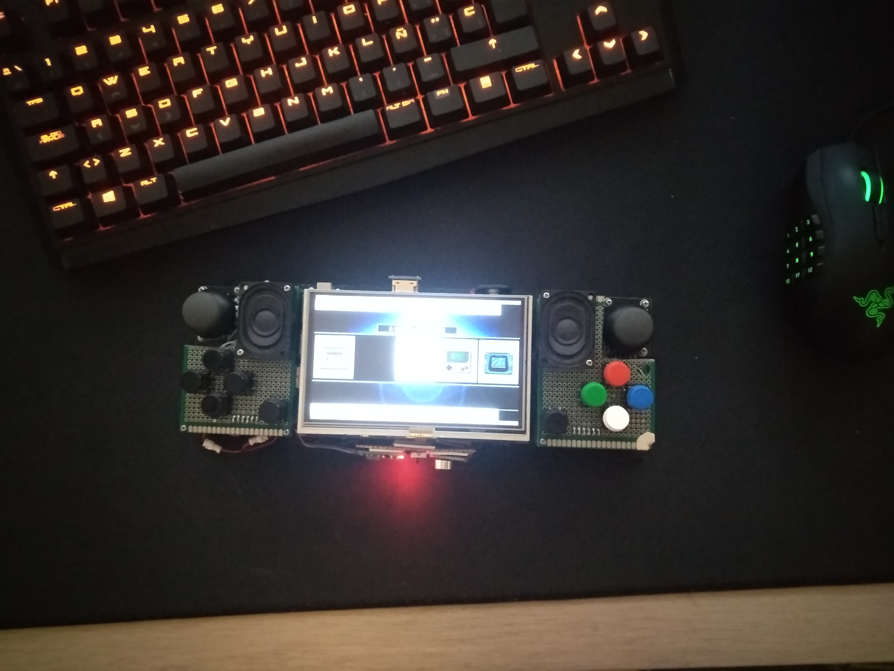
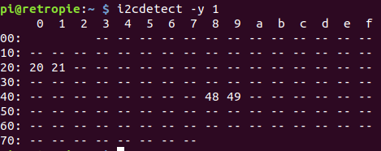
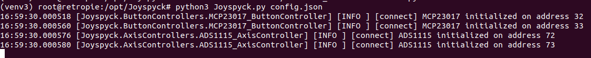
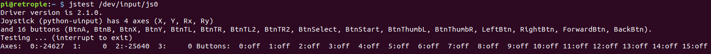

# Introduction

Joyspyck is an application that helps you to create controllers from scratch. It makes easy turning I/O hardware devices like I/O expanders, ADCs or accelerometers into uinput devices that can be used to interface with your computer.

Joyspyck is based on uinput and written in Python by Noemi Escudero ([Naeriam](https://github.com/naeriam)) and Guillermo Climent ([Willyneutron](https://github.com/willyneutron)).

# Compatibility
These are the devices that are currently supported by Joyspyck:

| Device    | Type  | Connection  | Libs                      | Notes                                               |
|-----------|-------|-------------|---------------------------------|-----------------------------------------------------|
| ADS1115   | Axis  | i2c         | [adafruit-circuitpython-ads1x15](https://github.com/adafruit/Adafruit_CircuitPython_ADS1x15)  | Low-power, 16-bit, i2c Digital to analog Converter. [Datasheet](http://www.ti.com/lit/ds/symlink/ads1114.pdf)  |
| MCP23017  | Buttons  | i2c  | [adafruit_mcp230xx](https://github.com/adafruit/Adafruit_CircuitPython_MCP230xx)  | 16-bit I/O Expander. [Datasheet](http://ww1.microchip.com/downloads/en/devicedoc/20001952c.pdf)  | 
| MPU6050  |  Axis | i2c  | SMBUS  | Six-Axis (Gyro + Accelerometer) motion tracking device. [Datasheet](https://www.invensense.com/wp-content/uploads/2015/02/MPU-6000-Datasheet1.pdf)  |
| FTDI devices (FT2232H) | Buttons  | USB   | [pyftdi](https://pypi.org/project/pyftdi/) | Implemented GPIO ports of FTDI devices as button imputs. [Datasheet](https://www.ftdichip.com/Support/Documents/DataSheets/ICs/DS_FT2232H.pdf). As specified in PyFTDI documentation, other FTDI devices with GPIO support are also compatible but have not been tested. |

Missing a device? Go to "Creating new modules" section and contribute!

All devices have been tested under Linux (Debian/Raspbian). Joyspyck is also compatible with Raspberry Pi!

# Motivation
We decided to develop this application as we were building our own mini game console based on Raspberry Pi and Retropie. We designed it to use ADS1115 and MCP23017 to implement controller buttons and analog sticks:

<div style="text-align:center">
    
    
    
</div>

We designed it that way to simplify the hardware side of the design. Using the built-in i2c port in the Raspberry Pi eliminated the need of a microcontroller between the i2c devices and the Raspberry. Also making changes in the configuration is easier using the JSON-based configuration of Joyspyck. Otherwhise, microcontroller firmware changes would be needed.

After making it work, we decided to shape it in the form of an apllication to be able to support more devices, publish it, and help other people with the same needs.

# Installation
In this installation example, Joyspyck will be installed in a Raspberry Pi 3B (Raspbian Stretch 9.4, 4.14.30-v7) and two ADS1115 and two MCP23017 will be also configured to be used as input for Retropie.

Installation in other Linux platforms should be pretty similar.

## Verifying i2c devices
In order to verify that all i2c devices are properly wired and working, the tool ```i2cdetect``` will be used. The i2c port to specify in command line depends on the platform. In this case is port 1. The tool may be also installed if not done before:

```bash
sudo apt-get install i2c-tools
i2cdetect -y 1
```
If all devices are wired and working, something like this will be reported:
<div style="text-align:center">
    
</div>
Both ADS1115 are in address 0x48 and 0x49 and both MCP23017 in 0x20 and 0x21 respectively.

## Installing all needed packages
First of all, basic packages need to be installed in order to run Joyspyck:

```bash
sudo apt-get install python3 python3-pip
```
Installing supervisor is also recommended, because is a good way to run Joyspyck in the background. You may also use systemd, initd, cron or similar tools for this purpose.

```bash
sudo apt-get install supervisor
```
Also a copy of Joyspyck will be needed, so let's clone it. A good place to clone it is on /opt:

```bash
cd /opt
git clone https://github.com/Naeriam/Joyspyck.git
```

Now it's time to create a python virtual environment and activate it:
```bash
cd Joyspyck
virtualenv -p /usr/bin/python3 venv
source venv/bin/activate
```

Next step is installing all needed packages using pip. The packages that will be needed depends on the Joyspick modules you want to use. In this case, all requeriments will be installed just for simplicity:

```bash
pip3 install -r requeriments.txt 
```

## Additional linux configuration
In some platforms, additional configuration may be needed for the system to properly detect uinput virtual devices. It is usually needed to add ```uinput``` to ```/etc/modules``` and adding a new rule to ```/etc/udev/rules.d/55-local.rules```:

```bash
SUBSYSTEM=="input", ATTRS{name}=="python-uinput", MODE="0666", ENV{ID_INPUT_JOYSTICK}="1"
```
A reboot may be needed to ensure that these configurations are properly loaded.


## Creating a configuration JSON
Joyspyck confuguration is based in 2 concepts:

 - **Joysticks**: Joysticks are uinput devices (```/dev/input/jsX```). You could create as many joysticks as you want and every one of them will appear in your system as a virtual controller plugged in. Each one of this devices has a list of button controllers and a list of axis controllers. ```waitTimeButtons``` and ```waitTimeAxis``` defines the time (in seconds) between polling controllers.

 - **Axis controllers**: This kind of devices belong to a joystick and control how the system translates the analog information retrieved from a certain hardware, to the movement of an analog axis of the virtual device.

 - **Button controllers**: This kind of devices belong to a joystick and control how the system translates the button input information retrieved from a certain hardware, to the status of the different buttons of the virtual device.

All controllers has a ```name``` to be easily referenced, a ```type``` indicating the system how to communicate with the hardware and a mapping that defines what joystick events will be triggered on a change in the information retrieved from the hardware. All possible events are listed [here](https://github.com/Naeriam/Joyspyck/blob/master/UInputEvents.py).

Every controller has also a ```options``` field. Depending on the type of the controller, different options are needed to tell the system how to communicate with the hardware and customize its behaviour. All options available for each of the controllers are detailed in the documentation of each module.

In this case, one sigle joystick will be created. Inside it, 2 button controllers and 2 axis controllers will be defined, in order to manage ADS1115 and MCP23017 devices.

Joyspyck config file is structured as a list of joysticks, so a possible configuration will be:

```json
[
  {
    "waitTimeButtons": 0.08,
    "buttonControllers": [
      {
        "name": "Left button controller",
        "type": "MCP23017",
        "options": {
          "address": "0x20",
          "busnum": 1
        },
        "mapping": [
          "BTN_SELECT",
          "BTN_RIGHT",
          "BTN_FORWARD",
          "BTN_LEFT",
          "BTN_BACK",
          "BTN_THUMBL",
          "BTN_TL",
          "BTN_TL2"
        ]
      },
      {
        "name": "Right button controller",
        "type": "MCP23017",
        "options": {
          "address": "0x21",
          "busnum": 1
        },
        "mapping": [
          "BTN_START",
          "BTN_A",
          "BTN_X",
          "BTN_Y",
          "BTN_B",
          "BTN_THUMBR",
          "BTN_TR",
          "BTN_TR2",
          "BTN_START",
          "BTN_A",
          "BTN_X",
          "BTN_Y",
          "BTN_B",
          "BTN_THUMBR",
          "BTN_TR",
          "BTN_TR2"
        ]
      }
    ],
    "waitTimeAxis": 0.08,
    "axisControllers": [
      {
        "name": "Left axis controller",
        "type": "ADS1115",
        "options": {
          "gain": 1,
          "address": "0x48",
          "busnum": 1,
          "calibration_max": 36241,
          "calibration_min": 10,
          "calibration_threshold": 0.08
        },
        "mapping": [
          "ABS_X",
          "ABS_Y"
        ]
      },
      {
        "name": "Right axis controller",
        "type": "ADS1115",
        "options": {
          "gain": 1,
          "address": "0x49",
          "busnum": 1,
          "calibration_max": 36241,
          "calibration_min": 10,
          "calibration_threshold": 0.08
        },
        "mapping": [
          "ABS_RX",
          "ABS_RY"
        ]
      }
    ]
  }
]

```

More examples of configuration files can be found on examples directory.

## Test
Before configuring Joyspyck as a daemon, it worth a try. To do so, superuser privileges will be needed. Also the python virtualenv would need to be activated.

<div style="text-align:center">
    
</div>

While running Joyspyck, it is possible to test if everything is running well by using jstest:

<div style="text-align:center">
    
</div>

### Running Joyspyck as a daemon on startup
The next step is creating a supervisor configuration file:

```bash
sudo nano /etc/supervisor/conf.d/Joyspyck.conf
```

```ini
[program:Joyspyck]
command= /opt/Joyspyck/venv/bin/python3 /opt/Joyspyck/Joyspyck.py /opt/Joyspyck/config.json
directory=/opt/Joyspyck/
autostart=true
autorestart=true
startretries=3
stderr_logfile=/var/log/supervisor/Joyspyck.err.log
stdout_logfile=/var/log/supervisor/Joyspyck.out.log
```

Reloading supervisor:
```
sudo supervisorctl reread
sudo supervisorctl start Joyspyck
```

## Aditional configuration
By default, Joyspyck spawns two threads per joystick. Each thread is in charge of polling the axis controllers or the button controllers of each one of the joysticks. If running it in one single thread is preferred, defining the option ```--wait-time``` with the time between pollings (in seconds) will make Joyspyck run all pollings from a single thread. In this mode ```waitTimeButtons``` and ```waitTimeAxis``` options will be ignored.

# Module details

## ADS1115 Controller
This controller is designed to communicate with ADS1115 devices connected over i2c. ADS1115 are Low-power, 16-bit, i2c Digital to analog converters ([Datasheet](http://www.ti.com/lit/ds/symlink/ads1114.pdf)) so they are suitable to read the position of an analog stick with each one of its 4 channels.

The communication with the hardware is done using [adafruit-circuitpython-ads1x15](https://github.com/adafruit/Adafruit_CircuitPython_ADS1x15).

|  Option | Default value  | Notes  |
|---|---|---|---|
| gain                  | 0         | Gain for the ADC conversion. See datasheet for details.  |
| address               | 0x48      | I2C Address to connect to where the device is located.  |
| calibration_max       | 32766     | Maximum value of the sensor reading. This value is used to normalize the output. This will be mapped to the maximum value of the axis.  |
| calibration_min       | -32766    | Minimum value of the sensor reading. This value is used to normalize the output. This will be mapped to the minimum value of the axis.  |
| calibration_threshold | 0.009     | Percentage (0 < p < 1) of the sensor reading to be considered inside the zero zone.  |

The controller will map the interval (0,N) readed from the sensor to (-N/2,N/2). A zero zone will be defined in the center of the mapped interval, so the noise of the sensor will not produce small changes in the axis. 

```
Readed value |---------------------------------------------------|   
             ^                                                   ^
        calibration_min                                   calibration_max

Mapped value |------------------------0--------------------------|
             ^          -threshold%        +threshold%           ^
          -32766             |        0        |               +32766
                                  zero zone
```

## MPU6050 Controller
This controller is designed to communicate with MPU6050 devices connected over i2c. MPU6050 are Six-Axis (Gyro + Accelerometer) motion tracking devices ([Datasheet](https://www.invensense.com/wp-content/uploads/2015/02/MPU-6000-Datasheet1.pdf)). They are suitable to manage 3 axis, X, Y and Z.

|  Option | Default value  | Notes  |
|---|---|---|---|
| busnum                | 1         | I2C bus number where the device is located (```/dev/i2c-X```). |
| address               | 0x68      | I2C Address to connect to where the device is located.  |
| calibration_threshold | 0.009     | Percentage (0 < p < 1) of the sensor reading to be considered inside the zero zone.  |

A zero zone will be defined in the center of the readed interval, so the noise of the sensor will not produce small changes in the axis. 

```
Readed value |------------------------0--------------------------|
             ^          -threshold%        +threshold%           ^
          -32766             |        0        |               +32766
                                  zero zone
```

## MCP23017 Controller
This controller is designed to communicate with MCP23017 devices over i2c. MCP23017 devices are 16-bit I/O expanders ([Datasheet](http://ww1.microchip.com/downloads/en/devicedoc/20001952c.pdf)). Every MCP23017 can manage up to 16 different joystick buttons.

The communication with the hardware is done using [adafruit_mcp230xx](https://github.com/adafruit/Adafruit_CircuitPython_MCP230xx).

|  Option | Default value  | Notes  |
|---|---|---|---|
| address               | 0x20      | I2C Address to connect to where the device is located.  |

## FTDI Controller
This controller is designed to communicate with FTDI devices. All testing was done with FT2232H ([Datasheet](https://www.ftdichip.com/Support/Documents/DataSheets/ICs/DS_FT2232H.pdf)). This devices can drive 1 button with each one of the GPIO outputs they have. The connection with the FTDI devices is done using the device URL, so if the device has more than one bus (like FT2232H has) they need to be configured with two different controllers.

For more details on how to set up FTDI devices, obtain device URLs and compatibility details, check [pyftdi documentation](https://eblot.github.io/pyftdi/). 

|  Option | Default value  | Notes  |
|---|---|---|---|
| ftdi_url               | empty      | URL of the device. See [pyFTDI docs](https://eblot.github.io/pyftdi/urlscheme.html) for more details. |

# Creating new modules
In order to create new modules, it is needed to implement one of ```AxisController``` or ```ButtonController``` base classes. Then, the new module will need to be added to the ```get_button_controller``` or ```get_axis_controller```, this way it could be instantiated when a device of a certain type is configured in the configuration JSON. All new modules must be included in either ```ÀxisControllers``` or ```ButtonControllers``` packages.

Also is really important to write in this documentation how the module works and the available options. Also do not forget to add your requirements to requirement.txt.

## Common functions
 - ```__init__(self, config)```: In this function, the module must call to the constructor of its parent class (```super().__init__(config)```). In this stage is also necessary to create the logger object and capture all the configuration options that comes from the JSON in ```config``` parameter. This is not the place to perform the connection to the device. The number of axis and buttons should be also set at this stage.

 - ```connect(self)```: In this function, the initial connection and configuration with the device needs to be made. No exceptions must be thrown, if something fails, an error message must be shown and the function must return ```False```. If the connection and configuration is done properly, the function must return ```True``` and a INFO message should be also logged.

## AxisController
All AxisControllers must also implement ```axis_value(self, index)```. This function must return the value of the axis designed by ```index```. All values must be contained in (-32766, +32766) interval.

## ButtonController
All ButtonControllers must also implement ```button_status(self, index)```, This function must return the value of the button designed by ```index```. All possible button values are defined in the class ```ButtonStatus```.

